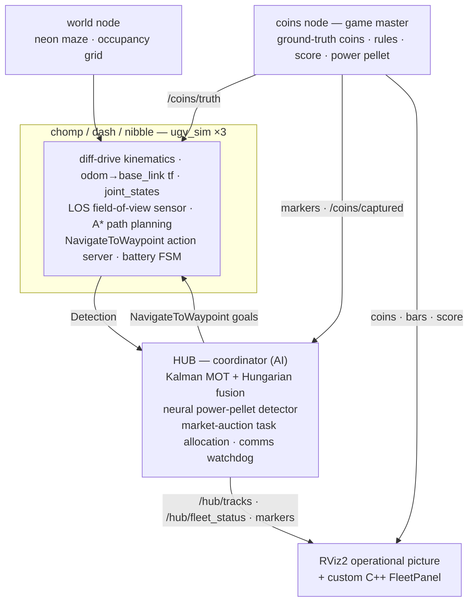

# 🕹️ PacFleet — A Robot Swarm That Plays Coordinated Pac-Man

> **A from-scratch ROS 2 simulation where three autonomous robots hunt coins through a neon maze — powered by real robotics: Kalman multi-object tracking, A\* path planning, market-based task auctions, a neural "power-pellet" detector, and a custom C++ RViz panel.**

[](https://docs.ros.org/en/jazzy/)
[](https://www.python.org/)
[](https://isocpp.org/)
[](https://github.com/ros2/rviz)
[](https://numpy.org/)
[](https://pytorch.org/)
[](https://ubuntu.com/wsl)

Built by [Elad Salama](https://www.linkedin.com/in/eladsalama)

---
<details open>
  <summary><b>Promo</b> (click to collapse)</summary>

  <p align="center">
    
  </p>
</details>

## Project Overview

**PacFleet** turns a serious multi-robot autonomy stack into an arcade game. Coins drift through a
neon maze; three robots — **Chomp**, **Dash**, and **Nibble** — search, chase, and capture them,
coordinating so no two pile on the same coin. Everything you'd expect from a real fleet is here — it
just happens to be playing Pac-Man:

- **Robots only see what's in their sensor cone** (field-of-view + Bresenham line-of-sight against
  the maze). Detections are noisy and occasionally dropped.
- **A central coordinator fuses those detections** into global tracks with a **Kalman multi-object
  tracker** + **Hungarian association** — two robots seeing the same coin tighten its uncertainty.
- **A market auction assigns each robot a target** (bids fold in distance, battery, and current
  tasking), and robots **plan A\* paths around the buildings** to reach them.
- **A coin is captured** when a robot is on it *and* the fleet is confident (the lock-on) — a
  progress bar fills faster with more robots and higher certainty.
- **Sometimes a coin turns into a power pellet**: it sprints and weaves, a **neural net flags it**
  from its motion, and the fleet **prioritizes** the swarm to run it down for bonus points.
- **Battery runs low → return to a recharging dock**; kill a robot process → a **comms watchdog**
  declares it lost within 3 s and re-auctions its coin.

<details open>
  <summary><b>Architecture Overview</b> (click to collapse)</summary>



| The robotics | In the game |
|---|---|
| Kalman MOT + Hungarian association | tracking every wandering coin, fusing multi-robot sightings |
| Track certainty (covariance) | the **lock-on** meter that gates a capture |
| A\* path planning on an inflated grid | robots **route around buildings** instead of jamming corners |
| Market auction (sealed-bid) | the fleet **coordinating** who chases which coin |
| Neural classifier (Torch → NumPy MLP) | spotting the **power pellet** from its motion |
| LOS raycast sensing + occlusion | coins **hide behind walls** → track coasts → reacquire |
| Custom `rviz_common::Panel` (C++/Qt) | the docked **fleet telemetry** sidebar |
| URDF/xacro · actions · tf2 · QoS · colcon | the robots and the ROS 2 plumbing |

</details>

## What's Under the Hood

- **Kalman multi-object tracking** — constant-velocity model sized for maneuvering targets,
  Mahalanobis gating (χ², 2 dof, 99%), **Hungarian assignment** (`scipy.optimize.linear_sum_assignment`),
  sequential multi-sensor fusion, and a tentative → confirmed → coasting lifecycle.
- **A\* path planning** — plans on an **inflated** occupancy grid (walls dilated by the robot
  radius), string-pulled to sparse waypoints, replanned as targets move.
- **Market-based task allocation** — a sealed-bid auction (the single-item cousin of CBBA/MURDOCH):
  bid = distance + battery penalty + retask penalty; the power pellet outbids everything.
- **Neural power-pellet detector** — a 3-16-16-1 MLP **trained in PyTorch**, but **inference is pure
  NumPy** from an `.npz` (train-time and runtime dependencies deliberately decoupled); features are
  calibrated against the tracker's *measured* output, not hand-guessed.
- **Custom C++ RViz panel** — a `rviz_common::Panel` (Qt/pluginlib) showing live per-robot
  telemetry; click a robot to fly the camera to it.
- **Real ROS 2 throughout** — custom msgs + a `NavigateToWaypoint` action with preemption, tf2,
  QoS profiles (sensor-data best-effort, transient-local latched), a URDF/xacro macro instanced per
  robot with prefixed frames, `robot_state_publisher`, multi-robot namespacing, and a `colcon`
  workspace mixing `ament_python` + `ament_cmake`.

## Quick Start (Ubuntu 24.04 + ROS 2 Jazzy)

```bash
# deps: ros-jazzy-desktop ros-jazzy-xacro liburdfdom-tools
#       python3-colcon-common-extensions python3-scipy qtbase5-dev
#       (torch CPU wheel only needed to re-train the classifier)
mkdir -p ~/pacfleet_ws/src && cd ~/pacfleet_ws/src
git clone https://github.com/eladsalama/PacFleet.git pacfleet
cd ~/pacfleet_ws && colcon build --symlink-install
source install/setup.bash
ros2 run fleet_sim train_classifier        # ~5 s, writes ~/.pacfleet/model.npz
ros2 launch fleet_sim bringup.launch.py    # rviz:=false for headless
```

Poke it while it runs:

```bash
ros2 topic echo /hub/tracks                 # fused tracks: status, covariance, label
ros2 topic echo /hub/fleet_status           # the unified fleet picture (drives the panel)
ros2 topic echo /coins/captured             # capture events
ros2 action send_goal /chomp/navigate_to_waypoint \
  fleet_interfaces/action/NavigateToWaypoint "{x: 30.0, y: 20.0}" --feedback
pytest fleet_sim/test/ -q                   # 21 unit tests — pure logic, no ROS runtime
```

In RViz: the **Fleet** panel lists every robot's live stats — click a name to focus the camera on it.

## Repo Layout

```
fleet_interfaces/   msgs + NavigateToWaypoint action (ament_cmake + rosidl)
fleet_description/  ugv.urdf.xacro — one macro, three robots
fleet_sim/
  fleet_sim/        worldmap.py (maze + A*)  tracking.py  auction.py  threat_classifier.py   <- pure logic
                    world.py  coins.py  ugv_sim.py  hub.py  ops_console.py                   <- ROS nodes
  launch/bringup.launch.py
  rviz/fleet_ops.rviz
  test/             21 pytest unit tests
fleet_panel/        custom C++ RViz panel (rviz_common::Panel, Qt/pluginlib)
promo/              Remotion source for the demo video
```

## Tech Stack

**Robotics/ROS 2**: ROS 2 Jazzy · rclpy/rclcpp · tf2 · actions · custom interfaces · QoS · URDF/xacro
· robot_state_publisher · colcon (ament_python + ament_cmake) · RViz2 + a custom C++ panel  
**AI/algorithms**: Kalman MOT · Hungarian association · A\* path planning · market-based auction ·
PyTorch → NumPy MLP · Bresenham line-of-sight  
**Environment**: WSL2 · Ubuntu 24.04 · Python 3.12 · C++17 · NumPy/SciPy

---

Built by [Elad Salama](https://www.linkedin.com/in/eladsalama) · [GitHub](https://github.com/eladsalama)
